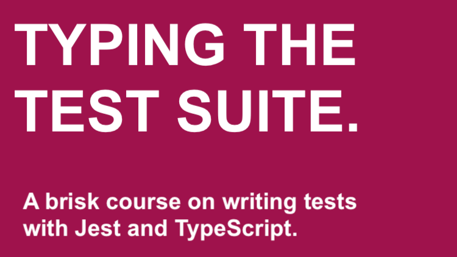

# Typing the Test Suite 

A brisk course on writing tests with Jest and TypeScript.

## What is this?

A quick course for intermediate level developers looking to get started with testing using Jest and TypeScript.

The first section focuses on using Jest with JavaScript and a bit of TDD. The rest of the course uses TypeScript, Jest, with either Node.js or React. It's 2 hours long and full of content.

We move fast, break things, then write tests to make sure they don't break again. The technologies used are:

- Jest (v26)
- TypeScript (v4)
- React.js (v17)
- React Testing Library (v11)

## Who is this for?

- Developers with some JavaScript/TypeScript, Node.js and React experience who'd like to learn to write tests.
- Highly motivated beginner who likes to jump in the deep end.

## How do I get it?

Two ways. You can buy it on Udemy, or you can buy it from me directly via Gumroad. Gumroad will let you download all the content in one shot, in glorious 1080p.

## How much does it cost?

It costs $15. I support purchasing power parity to make my content affordable to everyone. If this price is unaffordable for you, send me an email and we will make it work.

## Is there a preview?

You can preview the content here or get the source code here.

## I have more questions!

Send me an [email](mailto:lachlan@vuejs-course.com). 

## Curriculum

### 1.0 Introduction

Get everything setup and starting writing some tests with Jest. [Source code here](https://github.com/lmiller1990/typing-the-test-suite/tree/master/sections-1-2-3-4-intro-calc-matchers-nodejs/).

-    1.1 Installation
-    1.2 Your First Test
-    1.3 Adding an Assertion
-    1.4 Describing and Grouping Tests
-    1.5 Feedback Loop with Watch Mode
-   1.6 It.each for Concise Tests

### 2.0 Project: String Calculator

Put the skills learned in section one into practice by completing the String Calculator Kata. [Source code here](https://github.com/lmiller1990/typing-the-test-suite/tree/master/sections-1-2-3-4-intro-calc-matchers-nodejs/).

-    2.1 The First Test
-    2.2 Handling Whitespace
-    2.3 Throwing an Error
-    2.4 Testing the Error
-    2.5 Validating the Test Suite with a Functional Refactor
-    2.6 Completing the Functional Refactor

### 3.0 Matcher Madness

Do a deep dive into the various matchers Jest provides, from toBe and toEqual to the more exotic resolves and rejects matchers. [Source code here](https://github.com/lmiller1990/typing-the-test-suite/tree/master/sections-1-2-3-4-intro-calc-matchers-nodejs/).

  -  3.1 toBe
  -  3.2 toEqual, not
  -  3.3 toHaveProperty
  -  3.4 Resolves matcher for Promises
  -  3.5 Rejects matcher for Errors
  -  3.6 toHaveBeenCalled and Mock Functions
  -  3.7 Waiting with the Done Callback

### 4.0 TypeScript, Node.js and Jest

We introduce TypeScript and Jest by developing and testing a Node.js API. Note: This section assumes basic knowledge of Node.js and Express. [Source code here](https://github.com/lmiller1990/typing-the-test-suite/tree/master/sections-1-2-3-4-intro-calc-matchers-nodejs/).

-    4.1 TypeScript and Jest with ts-jest
-    4.2 Express Setup
-    4.3 The Jest Lifecylce: Before and After Hooks
-    4.4 Better Types
-    4.5 Adding JWT and a Refactor
-    4.6 Authorization Header
-    4.7 Testing for Success
-    4.8 Testing for Failure
-    4.9 Alternative Failed Assertion Syntax
-    4.10 Summary

### 5.0 TypeScript, React and Testing in a DOM Environment

Build a toy React app and see how to use TypeScript and Jest for DOM based testing with Testing Library. Note: this section assumes basisc knowledge of React. [Source code here](https://github.com/lmiller1990/typing-the-test-suite/tree/master/section-5-react).

-    5.1 Create React App and TypeScript
-    5.2 Rendering with Testing Library
-    5.3 Testing Library Assertions - getByText
-    5.4 useState and Asynchronous Assertions
-    5.5 Fetchign Data with useEffect
-    5.6 More Async Behavior with findAll
-    5.7 Mocking Axios with Jest Mocks
-    5.8 Toggling Todos

### 6.0 Jest Tips and Tricks

Learn some of Jest's more advanced features. Write your own custom matchers with TypeScript and write more robust, reuseable and (mostly) type-safe mocks. [Source code here](https://github.com/lmiller1990/typing-the-test-suite/tree/master/section-6-jest-advanced).

-    6.1 Section Overview
-    6.2 Custom Matcher API
-    6.3 Implementing the Matcher
-    6.4 Typing the Matcher
-    6.5 Setting up for Module Mocking
-    6.6 Inline Mocks Review
-    6.7 The Problem with Inline Mocks
-    6.8 Manual Mocks
-    6.9 Default Module Data
-    6.10 Typing the Mock Module
-    6.11 Improving the Spec Types
-    6.12 Jest Spies
-    6.13 What Next? More Learning Resources

